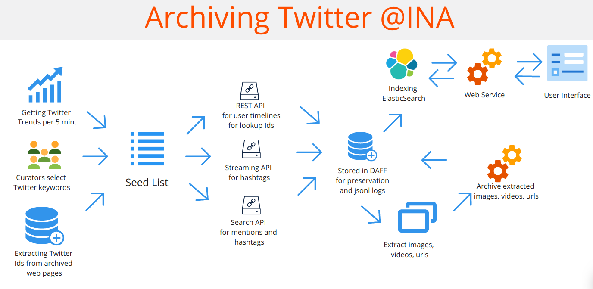

# Twitter Archiving

IMPORTANT : Archiving and indexing processes are only for Twitter APIs V1. 

Archiving the Social Media : Twitter case
Zeynep Pehlivan, Jérôme Thièvre and Thomas Drugeon
In The Past Web: exploring web archives, pages 43-56, Springer 2021

The French legal deposit extended its scope to cover
online public web contents in 2006 and DLWeb (legal deposit web) team at INA is
responsible for the collection and preservation of French websites with relation to
media and audio-visual content. Tweets are also archived as a part of legal deposit
since 2014. By using Twitter APIs more than 13 000 users timelines and 600 hashtags
are archived 24/24. This collection exceeded 1 milliard tweets (as of 06-2019), with
an average of 300 000 new tweets per day.

This repository contains the code I wrote to contribute to this project.
It is a part of an entire framework developed at dlweb INA so there will be missing dependincies.

Backend folder contains :
<ul>
  <li>dowser-ws-twitter : webservice between the interface and elasticsearch servers </li>
  <li>twitter-commons : contains common functions for different twitter projects</li>
  <li>twitter-crawler : crawler to archive tweets with different configurations/li>
  <li>twitter-indexer : to index crawl tweets in Elasticsearch</li>
</ul>

Interface folder contains the code to access to those archives here is a demo https://www.youtube.com/watch?v=z9-DYggXsZg. A small rappel :
By law, the access to the legal deposit web archives of Ina is limited to accredited researchers and strict conditions are defined regarding the use of the archives accessible at Inatheque (point of access to all legal deposit collections http://www.inatheque.fr). It is  specified that electronic material collected under legal deposit may be consulted “on site by duly accredited researchers … on individual workstations the usage of which is exclusively reserved to these researchers”. 
